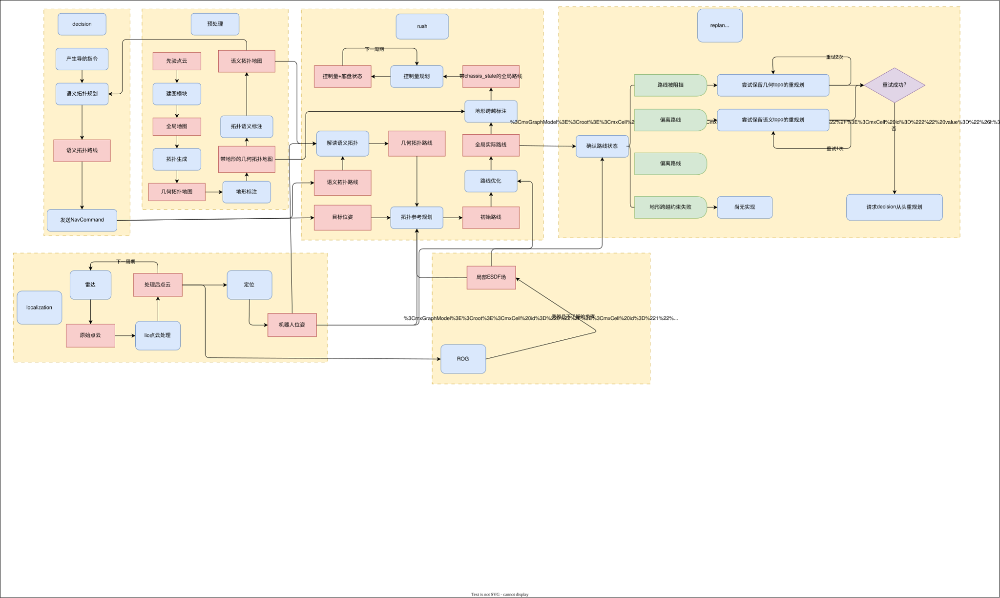

# Rush

Rush 是一个导航架构包，目标是将感知、Topo 全局规划、局部路线规划、路径优化、速度规划与控制串联起来，完成普通道路和特殊地形上的连续导航。

## 通信

一切从简，导航希望通信局限在以下几个话题/服务

| 通信方 | 类型 | 话题名 | 话题类型 | 作用 |
| :--- |:--- |:---|:---|:---|
| decision | 服务 | /rush/nav_executor_ctx | robot_msgs/srv/NavExecutorCtx | 启动时确认双方使用同一套地图配置 |
| decision | 话题 | /rush/plan/local_plan | robot_msgs/msg/LocalPlan | 发送控制量规划结果 |
| protocol | 话题 | /protocol/recv_odom | nav_msgs/msg/Odometry | 接收控制量的反馈值 |
| protocol | 话题 | /rush/input/chassis_state_fdb | std_msgs/msg/Int8 | 接收底盘状态反馈值 |
| localization | 话题 | /Odometry/imu_interpolation | nav_msgs/msg/Odometry | 接收定位数据 |
| decision | 服务 | /rush/input/nav_command | robot_msgs/srv/NavCommand | 接收导航任务从而启动导航程序 |
| localization | 话题 | /cloud_registered | sensor_msgs/msg/PointCloud2 | 接收点云更新局部地图 |
| decision | 话题 | /rush/status/nav_event | robot_msgs/msg/NavEvent | 发送导航执行任务过程中的一系列事件，包括到达目标点，正常运行中等 |
| deicision | 话题 | /rush/status/nav_replan_status | robot_msgs/msg/NavReplanStatus | 发送重规划信息 | 

## 可视化

为更好的做调试，导航会自己发送一些debug信息

## 日志

## 项目结构

本项目分为`感知`和`运动`两大版块，大致思路如下图所示。



### 感知

#### 全局地图

全局地图通常由先验的点云建图而来，使用`localization`模块内的建图手段，可以获得场地点云，并将其转化为先验地图。

#### 局部地图

局部地图选用的是`ROG-Map`方案，它可以保证较低性能开销的同时维持周围一定范围内的障碍物地图

#### 几何拓扑

几何拓扑主要靠`分叉`来识别路口和普通可通行节点，正常把拓扑骨架中的点分为三类，`endpoint`, `edge`和`junction`，分别对应周围有1条，2条和3条可通行路径。
生成几何拓扑图时，主要靠对道路进行分叉搜索，并且每次都搜寻区域内的最安全的`安全走廊`作为几何拓扑图的路径。


#### 地形标注

如果采用自动识别地形的方案，无疑会遇到许多风险，比如算法稳定性和鲁棒性，识别过多地形给规划造成过多可选项，给规划造成不必要的压力，因此对于地形标注，我们选择`手动标注`的方式。
对每个拓扑边和其区域，可以给它附着不同的标签，随后由程序自动重新生成语义拓扑连接图。

#### 地形识别

在遇到地形区域的时候，需要比较建图时点云和扫描所得点云的差别，从而判断是否有真正的障碍物。这需要和ROG-Map的观测结果作结合。
同时，如果规划需要经过地形段，在静态障碍物部分需要对那部分障碍物进行一定宽度的临时抹除。

### 运动

#### 语义转化

首先接收到语义拓扑路径后，需要根据语义和几何topo的对应关系，先把它转化成几何拓扑路径

#### 几何拓扑规划

几何拓扑规划是语义拓扑和实际路径规划之间的中间层。语义拓扑只描述“经过哪些区域、拓扑边或地形段”，而几何拓扑需要为这些拓扑关系提供实际的空间结构，使后续规划能够在地图坐标中工作。

几何拓扑不直接等同于最终轨迹，也不负责输出控制量。它主要保存拓扑边在几何空间中的表达，例如边的中心线、起止位姿、允许的通行宽度、连接关系以及附着的地形信息。规划时，几何拓扑路径会进一步生成拓扑走廊或可行区域，作为动力学规划和路径优化的约束。

整体转换关系如下：

```text
语义拓扑路径
    → 语义边与几何边匹配
    → 几何拓扑路径
    → 生成拓扑走廊 / 可行区域
    → 拓扑参考规划
    → MINCO 路径优化
```

几何拓扑边可以附带以下信息：

- 几何中心线或参考路径；
- 起点、终点及其朝向；
- 与相邻拓扑边的连接关系；
- 允许的横向偏移范围或走廊宽度；
- 地形类型、穿越方向和底盘执行约束；
- 该拓扑边是否允许反向、绕行或作为重规划候选。

因此，几何拓扑承担的是“把路线意图变成带空间约束的规划输入”。它需要保持拓扑连通性，但不要求中心线就是最终最优路径：拓扑参考规划负责先生成动力学可行路径，MINCO 再在允许范围内优化路径形状，最后由 MPC 根据机器人状态和局部地图输出控制量。

#### 拓扑参考规划

使用带动力学和拓扑参考的规划，在拓扑路径周围一定半径区域上生成一段可行区域，所有规划都局限在可行区域内

#### 路径优化

选择MINCO优化，主要对几何形状作优化，同样受到可行区域的限制，但稍微放宽要求

#### 控制量输出

选择MPC，根据一些代价进行优化出最优解

## 规划数据和模块职责

### 几何拓扑数据

几何拓扑图由节点和边组成。节点表示道路或可通行区域的连接位置，边表示两个节点之间的一段可通行几何结构。

几何拓扑节点主要分为三类：

- `endpoint`：只有一条可通行路径连接的端点；
- `edge`：前后各有一条可通行路径的普通节点；
- `junction`：存在三条或更多可通行路径的分叉节点。

几何拓扑边不应只保存一条无属性的折线，还需要逐步补充以下信息：

```text
GeometricEdge
├─ 起点和终点节点
├─ 中心线 / 安全走廊
├─ 可通行宽度
├─ 地形标签和穿越方向
└─ 是否是单向边，方向如何
```

几何拓扑边的中心线是规划参考，不是最终执行轨迹。后续规划可以在其附近调整路径，但不能破坏拓扑连通关系或越过不可通行区域。

### 语义拓扑到几何拓扑

`decision` 或上层任务模块提供的是语义层面的导航目标和路线意图。语义拓扑路径只说明需要经过哪些区域或拓扑边，不直接包含完整的连续路径点。

`SemanticTopoMap` 负责根据起点、目标点和地图语义生成语义拓扑路径；`GeometricTopoMap` 再将语义拓扑边匹配为一组有方向的几何拓扑边，并拼接成几何参考路径。

```text
目标位姿
    → 语义拓扑规划
    → 语义拓扑路径
    → 语义边 / 几何边匹配
    → 几何拓扑路径
```

映射过程中需要检查：

- 语义边是否存在对应的几何边；
- 相邻几何边的端点和方向是否连续；
- 当前机器人位姿是否能接入该几何路径；
- 地形标签和通行方向是否正确传递；
- 路径中是否存在已经失效或被障碍物阻塞的边。

### 拓扑走廊和可行区域

几何拓扑路径需要转换成规划器可使用的拓扑走廊。走廊由几何中心线向两侧扩展得到，同时受到地图障碍物、地形区域和机器人尺寸的限制。

```text
几何拓扑路径
    → 障碍物膨胀
    → 地形和方向约束叠加
    → 横向范围限制
    → 拓扑走廊 / 可行区域
```

拓扑走廊的作用是限制搜索范围，避免规划器为了绕开局部代价而跳到另一条语义路线。不同规划阶段可以使用不同强度的约束：

- 拓扑参考规划：使用较严格的可行区域，优先保证动力学可行和拓扑一致；
- MINCO：在不明显离开走廊的前提下优化路径形状、曲率和连续性；
- MPC：根据实时位姿、底盘状态和局部代价进行短时域跟踪与避障。

## 完整规划流程

一次导航任务的理想规划流程如下：

```text
NavCommand
    → 检查地图配置和任务参数
    → 获取机器人位姿和目标位姿
    → 语义拓扑规划
    → 语义拓扑路径
    → 几何拓扑转换
    → 拓扑走廊生成
    → 空间 A* / 拓扑参考规划
    → Kinodynamic A*
    → MINCO 路径优化
    → 地形跨越标注
    → 生成可执行路径
    → 路径跟踪和 MPC 控制
```

规划结果建议区分为几种不同层次：

```text
SemanticRoute      语义拓扑路线
GeometricRoute     几何拓扑路线
ReferencePath      规划器使用的参考路径
OptimizedPath      MINCO 优化后的路径
ExecutablePlan     带地形和底盘约束的执行计划
```

这样可以避免把“拓扑路线”“几何路径”和“最终控制轨迹”混合在同一个 `Path2f` 中。

## 地形约束和跨越契约

地形标签由离线人工标注产生，在线点云和局部地图主要用于判断该地形区域当前是否存在真实障碍，而不是重新推断全部地形语义。

当规划路径经过特殊地形时，需要为对应路径段附加跨越契约，例如：

```text
TerrainContract
├─ 地形类型
├─ 进入 / 离开位姿
├─ 推荐穿越方向
├─ 最大速度和曲率
├─ 所需底盘模式
├─ 允许的横向偏差
└─ 跨越失败后的处理方式
```

如果地形本身允许通行，但先验地图中的静态点云被普通障碍层标记，则只在本次规划上下文中生成临时代价图，对指定地形区域进行受限抹除。原始全局地图不被修改，实时点云仍可以重新发现实际障碍。

## 在线地图和局部避障

在线地图主要由定位和实时点云共同维护：

```text
定位数据
    → 机器人位姿

registered_cloud
    → ROG-Map / 局部地图
    → 当前局部代价图
    → 局部重规划和 MPC
```

地图数据的使用范围不同：

- 全局地图和几何拓扑：用于生成全局路线；
- 局部地图：用于判断当前路线是否被阻挡；
- 当前局部代价图：用于局部重规划和安全检查；
- 如果具备动态障碍预测：未来多帧代价图可以进入 MPC 预测时域。

## 重规划和安全策略

重规划不应只表示“重新调用一次 A*”，而应根据问题来源选择不同层级的恢复方式：

```text
路线局部被阻挡
    → 在当前几何拓扑内重规划

几何拓扑路线无法通过
    → 保持语义拓扑，重新选择几何路线

语义路线整体失效
    → 请求 decision 重新生成语义路线

定位、底盘或局部地图失效
    → 停止发布新的控制量
    → 减速或安全停车
```

建议将重规划状态单独管理，并通过 `NavReplanStatus` 对外发布原因、阶段和结果。导航状态至少需要覆盖：

```text
IDLE → PLANNING → EXECUTING → REACHED
          │           │
          └───────────┴→ REPLANNING
                              │
                              ├→ EXECUTING
                              ├→ PLANNING
                              └→ ERROR
```

## 运行周期和通信边界

全局规划和控制执行使用不同的运行周期：

```text
全局规划周期：目标、地图或路线失效时触发
控制周期：根据底盘状态和机器人位姿持续输出控制量
重规划检查周期：检查偏离、阻挡、定位和地图超时
```

`rush` 与外部模块的职责边界如下：

```text
decision
    ├─ NavCommand → rush
    ├─ NavExecutorCtx ↔ rush
    ├─ NavEvent ← rush
    └─ NavReplanStatus ← rush

localization
    ├─ Odometry → rush
    └─ registered_cloud → rush

protocol
    ├─ chassis_state → rush
    └─ LocalPlan ← rush
```

`rush` 内部负责路线生成、路径优化、执行状态和控制量规划；具体底盘动作由底盘控制器执行，`rush` 通过执行计划中的底盘模式和控制约束与其协作。

## 当前实现进度

当前代码已经建立了导航模块的基本接口和目录结构，包括地图配置、占据栅格、语义拓扑、几何拓扑、A*、Kinodynamic A*、MINCO、MPC 和重规划状态机的入口。几何拓扑到可执行路径的完整数据结构和算法仍在实现中。

后续实现顺序建议为：

1. 定义几何拓扑节点、边和拓扑路径的数据结构；
2. 实现语义拓扑边到几何拓扑边的映射；
3. 从几何拓扑路径生成拓扑走廊；
4. 接入空间 A* 和 Kinodynamic A*；
5. 接入 MINCO 和地形跨越契约；
6. 定义 `ExecutablePlan` 并接入 MPC；
7. 完善局部地图、重规划和安全停车逻辑。
